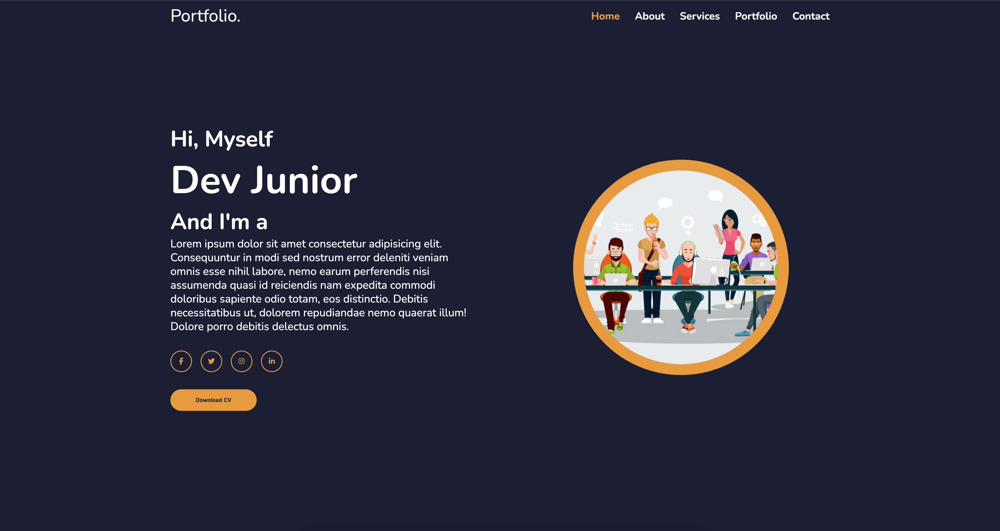
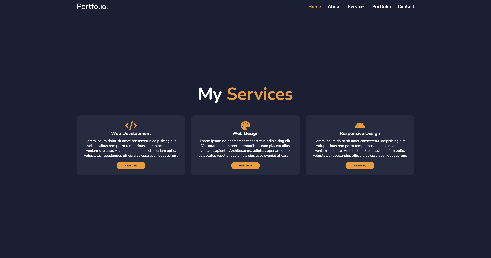
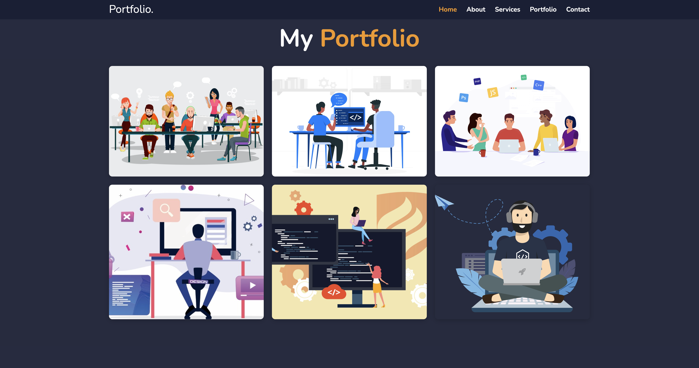
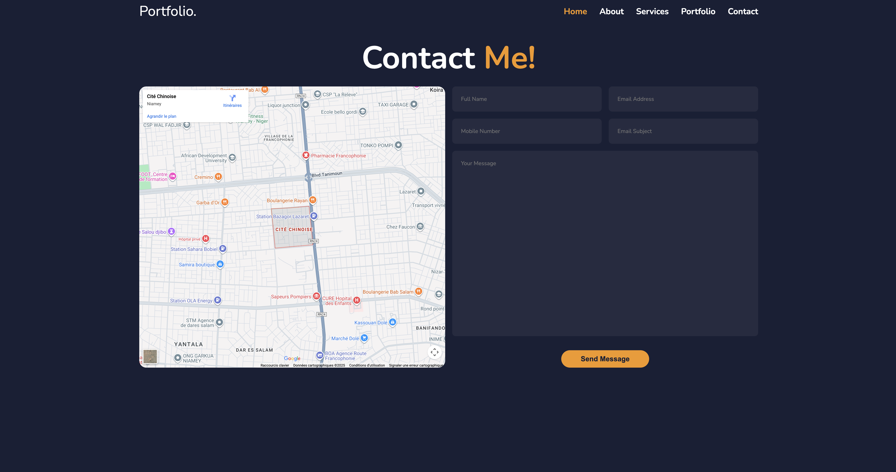

# 🌐 Portfolio - Site Frontend Responsive

## 🧾 Description du projet

Ce projet est un **site web personnel de type portfolio**, entièrement conçu en **HTML et CSS**, visant à présenter mes compétences, mes projets et mon parcours professionnel de manière claire et esthétique. L’objectif principal est de créer une **vitrine digitale personnelle** qui reflète à la fois mon style et mon professionnalisme, tout en offrant une **expérience utilisateur fluide et agréable** sur tous les appareils.

Le site est pensé pour être **responsive**, ce qui signifie qu’il s’adapte automatiquement aux différentes tailles d’écran : ordinateurs de bureau, tablettes et smartphones. Grâce à l’utilisation de **Flexbox, Grid et Media Queries**, la mise en page reste harmonieuse et lisible, peu importe le dispositif utilisé.

Le design a été réfléchi pour être **moderne, minimaliste et élégant**, avec une attention particulière portée à :

- la lisibilité du contenu
- l’accessibilité des informations importantes,
- l’impact visuel grâce à des couleurs harmonieuses, des typographies claires et des effets d’ombre ou de survol subtils.

Les sections principales du site incluent :

- **Home** : présentation personnelle et professionnelle,
- **About** : présentation personnelle et professionnelle,
- **Services** : mise en avant des technologies et savoir-faire,
- **Portfolio** : galerie de travaux réalisés avec description et images,
- **Contact** : formulaire et liens vers les réseaux sociaux pour faciliter la prise de contact.

Ce projet permet non seulement de démontrer mes compétences en **front-end development**, mais sert également d’outil concret pour partager mon travail avec de futurs employeurs ou clients. Il représente un équilibre entre **esthétique visuelle**, **fonctionnalité pratique** et **expérience utilisateur optimale**.

---

## 🖥️ Technologies utilisées

- **HTML5** — structure sémantique et contenu  
- **CSS3** — styles, animations et responsive design  
- **Flexbox & Grid** — mise en page adaptative  
- **Media Queries** — adaptation à tous types d’écrans  
- **Animations CSS** — pour des effets de survol et transitions visuelles  

---

## 🎨 Fonctionnalités principales

- Design moderne et minimaliste  
- Entièrement responsive (mobile, tablette, desktop)  
- Sections claires : À propos, Compétences, Projets, Contact  
- Effets d’animation au survol et transitions fluides  
- Mise en avant des projets avec images et descriptions  
- Formulaire de contact et liens vers les réseaux sociaux  

---

## 📱 Aperçu du rendu







Lien du site en ligne : [👉 Voir le portfolio] ()

---

## 🚀 Installation et utilisation

1. **Cloner le projet :**

   ```bash
   git clone https://github.com/moulaye-omar/portfolio.git
